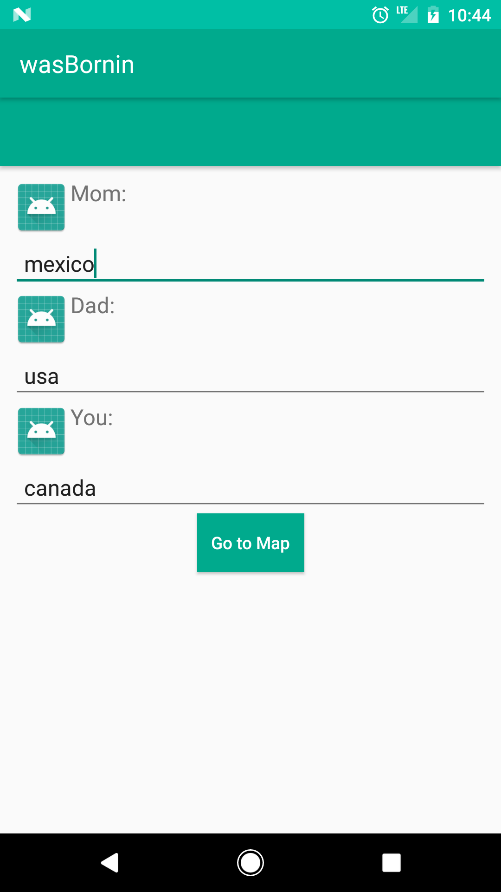
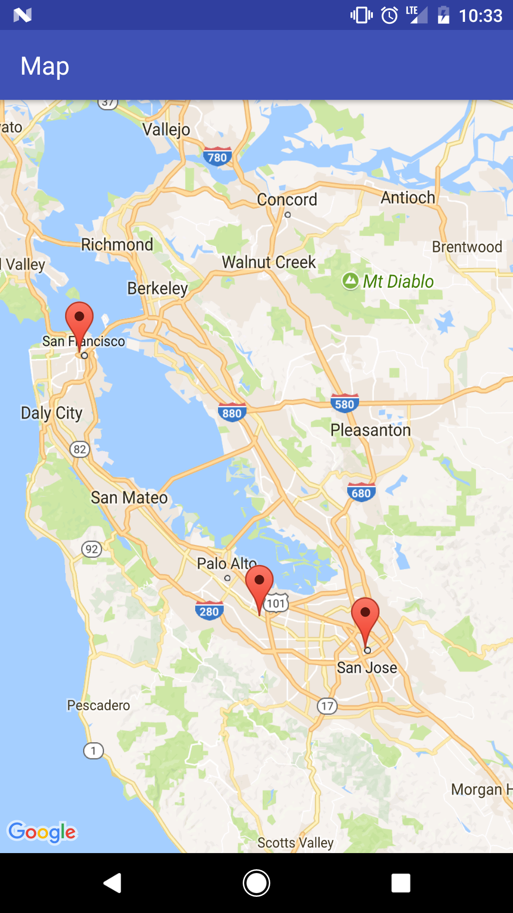

# KotlinLearningMap

##Demo

###Code

I'm using Android Studio 3.0, Kotlin, and gradle 4.0

- Google Maps API
- Kotlin and Anko
- Geocoder [gets location(lat, long) from address]

#Resources
map kotlin tutorial:
https://www.mytrendin.com/draw-route-two-locations-google-maps-using-kotlin-android/

read about kotlin tests below:
https://github.com/pot8os/Kotlin-Espresso-sample
https://fernandocejas.com/2017/02/03/android-testing-with-kotlin/
https://github.com/android10/Android-KotlinInTests
https://www.youtube.com/watch?v=_f-qkGJBPts