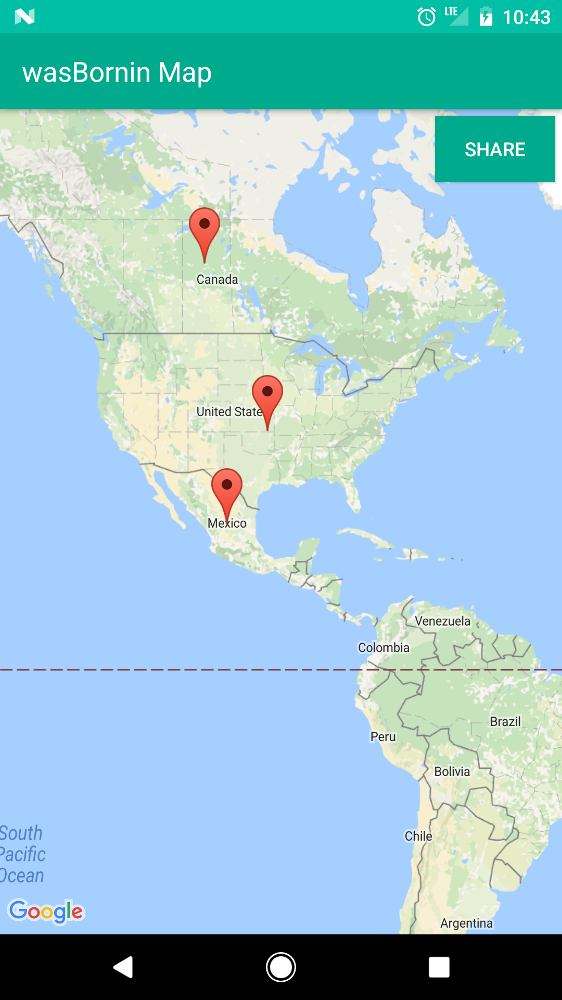

# KotlinLearningMap

## Demo

## Enter info:

## Map shows born locations:

## Code

Using Android Studio 3.0, Kotlin, and gradle 4.0

- Google Maps API
- Kotlin and Anko
- Geocoder (gets lat and long location from address) example: val SF = LatLng(37.773972, -122.431297)

## Resources
map kotlin tutorial:
https://www.mytrendin.com/draw-route-two-locations-google-maps-using-kotlin-android/

read about kotlin tests below:
https://github.com/pot8os/Kotlin-Espresso-sample
https://fernandocejas.com/2017/02/03/android-testing-with-kotlin/
https://github.com/android10/Android-KotlinInTests
https://www.youtube.com/watch?v=_f-qkGJBPts

common views:
https://drive.google.com/file/d/0B5XIkMkayHgRMVljUVIyZzNmQUU/view

screenshot and share:
http://www.androhub.com/take-a-screenshot-programmatically-in-android/

material colors:
https://material.io/guidelines/style/color.html#color-color-palette